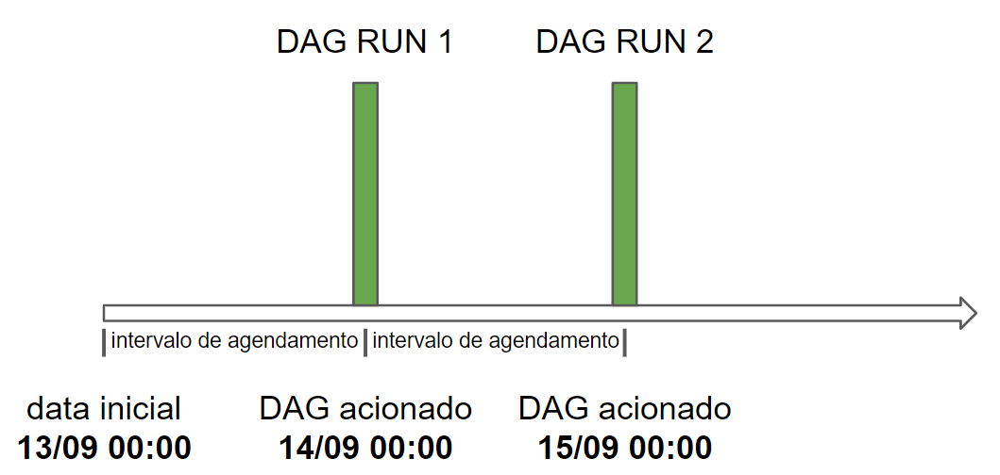
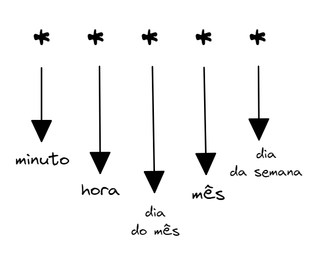

## Para saber mais: Operators

Os operadores são classes Python que encapsulam a lógica para fazer uma unidade de trabalho, ou seja, uma tarefa. Eles definem as ações que serão concluídas para cada unidade de trabalho e abstraem muito código que teríamos que escrever. Quando instanciamos um operador e passamos os parâmetros necessários, a instância desse operador passa a ser uma tarefa.

Existem muitos tipos diferentes de operadores disponíveis no Airflow e o trabalho que cada um faz varia muito. Alguns dos operadores mais usados são:

- **PythonOperator**: executa uma função Python;
- **BashOperator**: executa um script bash;
- **KubernetesPodOperator**: executa uma imagem definida como imagem do Docker em um pod do Kubernetes;
- **SnowflakeOperator**: executa uma consulta em um banco de dados Snowflake;
- **EmailOperator**: envia um e-mail.

O Airflow tem um conjunto muito extenso de operadores disponíveis. No entanto, se não existir um operador para seu caso de uso, você também pode criar os seus próprios operadores.

**Características de um Operador**
Um operador possui 3 características principais:

1. **Idempotência**: independentemente de quantas vezes uma tarefa for executada com os mesmos parâmetros, o resultado final deve ser sempre o mesmo;

2. **Isolamento**: a tarefa não compartilha recursos com outras tarefas de qualquer outro operador;

3. **Atomicidade**: a tarefa é um processo indivisível e bem determinado.

Para mais informações sobre os operadores, acesse a documentação:

- [Operators](https://airflow.apache.org/docs/apache-airflow/2.3.2/concepts/operators.html)

## Para saber mais: atualização de alguns módulos do Airflow

Ao executar o seu DAG, caso receba warnings (avisos) referentes ao days_ago ou à importação do bash_operator, siga os passos abaixo para evitá-los.

- **Uso de `days_ago`**:

Algumas versões mais recentes do Airflow descontinuaram a função days_ago. Se ao tentar utilizá-la você receber um aviso, não se preocupe. Em substituição, você pode utilizar a biblioteca pendulum. Veja como fazer:

```python
import pendulum
pendulum.today('UTC').add(days=-N)
```

- **Alteração no `bash_operator`**:

Em versões mais recentes do Airflow, o módulo `airflow.operators.bash_operator` foi substituído por `airflow.operators.bash`.

Com essas atualizações, o código do nosso DAG fica assim:

```python
import pendulum
from airflow.models import DAG
from airflow.operators.empty import EmptyOperator
from airflow.operators.bash import BashOperator

with DAG(
            'meu_primeiro_dag',
            start_date=pendulum.today('UTC').add(days=-1),
            schedule_interval='@daily'
) as dag:

        tarefa_1 = EmptyOperator(task_id='tarefa_1')
        tarefa_2 = EmptyOperator(task_id='tarefa_2')
        tarefa_3 = EmptyOperator(task_id='tarefa_3')
        tarefa_4 = BashOperator(
            task_id='cria_pasta',
            bash_command='mkdir -p "home/millenagena/Documents/airflowalura/pasta"'
        )

        tarefa_1 >> [tarefa_2, tarefa_3]
        tarefa_3 >> tarefa_4
```

## Para saber mais: agendamento no Airflow

Um dos recursos mais fundamentais do Apache Airflow é a capacidade de agendar trabalhos. Dessa forma, é importante conhecermos alguns termos do Airflow que são relacionados ao agendamento:

- **`Data de início (start date)`**: data em que o DAG começa a ser agendado. **Essa data é o início do intervalo de dados que você deseja processar;**

- **`Intervalo de agendamento (schedule interval)`**: define o intervalo de tempo em que o DAG é acionado. Por exemplo, "@daily" significa que o DAG deve ser acionado todos os dias à meia-noite;

- **`Intervalo de dados (data interval)`**: propriedade de cada DAG Run que representa o intervalo de tempo em que cada tarefa deve operar. Por exemplo, para um DAG agendado de dia em dia, cada intervalo de dados começará no início (00:00) e terminará no final do dia (23:59). **A execução do DAG acontece no final do intervalo de dados;**

- **`Data lógica (logical date)`**: é a mesma do início do intervalo de dados. Não representa quando o DAG será realmente executado. Antes do Airflow 2.2, era chamada de data de execução.

É importante ressaltar que o DAG só é acionado após a **data de início + o intervalo de agendamento**, ou seja, no final do intervalo de dados. Por exemplo: se temos um DAG com a data de início igual a **13/09** e com o schedule interval igual a "@daily", indicando que ele deve ser executado todos os dias à meia noite, sua dinâmica de execução vai ser a seguinte:



Para mais informações, consulte a documentação:

- [Scheduler](https://airflow.apache.org/docs/apache-airflow/2.2.3/concepts/scheduler.html);
- [DAG Runs](https://airflow.apache.org/docs/apache-airflow/2.2.3/dag-run.html).

## Para saber mais: agendamento no Airflow

A modelagem no Airflow nos permite passar informações dinâmicas para as instâncias de tarefa em tempo de execução. Vamos usar, como exemplo, a tarefa que fizemos anteriormente:

```python
   tarefa_4 = BashOperator(
        task_id = 'cria_pasta',
        bash_command = 'mkdir -p "/home/millenagena/Documents/airflowalura/pasta={{ data_interval_end }}"'
      )
```

Neste exemplo, o valor entre as chaves duplas `{{ }}` é nosso código modelo a ser avaliado em tempo de execução. O conteúdo retornado pela variável `data_interval_end` é a data final do intervalo de dados, ou seja, a data de acionamento do DAG.

O Airflow utiliza o **Jinja**, uma estrutura de modelagem em Python, como seu mecanismo de modelagem. Vamos conhecer mais algumas variáveis que podemos utilizar em tempo de execução:

- data_interval_start: data do início do intervalo de dados;
- data_interval_end: data do fim do intervalo de dados;
- ds: data lógica de execução do DAG;
- ds_nodash: data lógica de execução do DAG sem nenhuma separação por traços.

O Airflow inclui muitas outras variáveis ​​que podem ser usadas para modelagem. Caso queira conhecê-las, consulte a documentação:

- [Templates reference](https://airflow.apache.org/docs/apache-airflow/2.3.2/templates-ref.html)

## Para saber mais: CRON Expressions

Quando queremos definir intervalos de tempo um pouco mais complexos para a execução do nosso DAG, o Airflow permite a utilização das chamadas Cron Expressions. A sintaxe delas consiste em 5 componentes:



Sendo os valores possíveis para cada um desses componentes:

- minuto: 0-59;
- hora: 0-23;
- dia do mês: 1-31;
- mês: 1-12;
- dia da semana: 0-6 representando de domingo a sábado.

No caso do nosso DAG, queremos que ele seja executado toda segunda-feira do mês, às 00h00. Por isso, passamos a seguinte Cron Expression para o parâmetro schedule_interval:

```python
schedule_interval = 0 0 * * 1
```

Caso queira conhecer mais sobre essas expressões, deixo a sugestão do texto explicativo abaixo:

- [CRON expression](https://en.wikipedia.org/wiki/Cron#CRON_expression);

## Para saber mais: passando informações entre tarefas

Muitas das vezes, quando estamos desenvolvendo um DAG, precisamos compartilhar dados entre as tarefas existentes. Um exemplo de uma situação que precisaríamos fazer isso, seria no desenvolvimento de um DAG que realiza o processo de ETL, ou seja, de extração, transformação e carregamento de dados.

Em um pipeline desse, precisaríamos ter uma tarefa para cada uma das 3 etapas. Dessa forma, seria necessário compartilhar os dados de uma tarefa para a outra. Existem alguns métodos que podemos usar para implementar o compartilhamento de dados entre nossas tarefas do Airflow. O método que vamos conhecer para passar dados entre as tarefas do Airflow é usar o **XCom**.

**XCom**

O XCom é um recurso nativo do Airflow para compartilhar dados de tarefas. Esse recurso permite que as tarefas troquem metadados de tarefas ou pequenas quantidades de dados. Eles são definidos por chave, valor e data.

Os XComs podem ser enviados (xcom.push) ou recebidos (xcom.pull) por uma tarefa. Quando enviado por uma tarefa, ele é armazenado no banco de dados do Airflow e fica disponível para todas as outras tarefas.

Esse recurso deve ser utilizado apenas para passar pequenas quantidades de dados entre as tarefas. Ele não foi projetado para passar dados como DataFrames ou semelhantes. Para casos como esse, podemos utilizar o armazenamento de dados intermediário, que é mais apropriado para grandes blocos de dados.

Você pode encontrar mais informações sobre isso acessando a documentação: [Custom XCom Backends](https://airflow.apache.org/docs/apache-airflow/2.3.2/concepts/xcoms.html#custom-xcom-backends). E, caso queira aprender mais sobre os XComs e como implementá-los, acesse a documentação: [XComs](https://airflow.apache.org/docs/apache-airflow/2.3.2/concepts/xcoms.html#xcoms).
