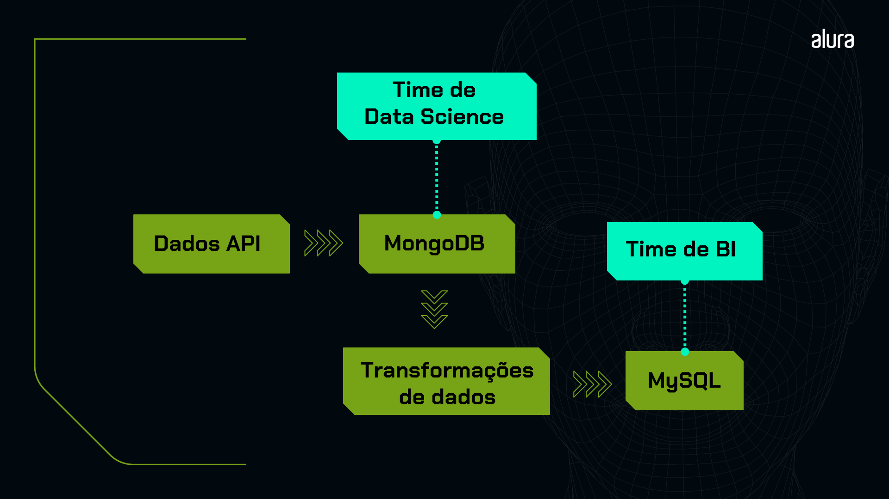

# Pipeline de Dados: API para MongoDB e MySQL

Este é um projeto de estudos que implementa um pipeline de dados completo. O pipeline extrai dados de vendas de produtos de uma API pública, armazena-os em um banco de dados NoSQL (MongoDB), realiza transformações nesses dados utilizando Python e a biblioteca Pandas, e, por fim, carrega os dados transformados em um banco de dados relacional (MySQL).

O projeto está organizado em scripts Python para automação e Jupyter Notebooks para exploração e execução passo a passo.

## 🚀 Etapas do Pipeline

Ao longo deste curso, vamos atuar como pessoas engenheiras de dados em uma empresa de e-commerce, desenvolvendo um pipeline de dados, que é basicamente uma sequência estratégica de operações projetada para resolver problemas de gerenciamento de dados.

Nosso objetivo principal com esse pipeline é disponibilizar informações de vendas de 2020 a 2023, atualmente em uma API, para as equipes que precisam delas. Cada equipe possui necessidades distintas, o que torna nosso trabalho como engenheiras(os) de dados ainda mais crucial.

Na imagem abaixo, podemos conferir um overview do pipeline que precisamos construir:



O pipeline é dividido em três etapas principais:

1.  **Extração e Armazenamento (Extract & Store)**
    *   O script `scripts/extract_and_save_data.py` conecta-se à API `https://labdados.com/produtos`.
    *   Os dados, em formato JSON, são extraídos e armazenados em uma coleção chamada `vendas` no banco de dados `db_vendas` do MongoDB.

2.  **Transformação (Transform)**
    *   O script `scripts/transform_data.py` lê os dados brutos do MongoDB.
    *   Realiza transformações como a renomeação de colunas (`lat` para `Latitude`, `lon` para `Longitude`) e a formatação de datas para o padrão `YYYY-MM-DD`.
    *   Filtra os dados para criar dois conjuntos distintos: um contendo apenas produtos da categoria "livros" e outro com produtos vendidos a partir de 2021.
    *   Salva os dois conjuntos de dados transformados como arquivos CSV (`livros_script.csv` e `produtos_script.csv`) no diretório `data/`.

3.  **Carregamento (Load)**
    *   O script `scripts/save_data_mysql.py` lê um arquivo CSV (no exemplo, `tabela_livros.csv`).
    *   Carrega o conteúdo do CSV para uma tabela chamada `tb_livros` no banco de dados `db_produtos_teste` do MySQL. O script também se encarrega de criar o banco e a tabela, caso não existam.

## 🛠️ Tecnologias Utilizadas

*   **Linguagem**: Python 3
*   **Bancos de Dados**:
    *   MongoDB (NoSQL)
    *   MySQL (Relacional)
*   **Bibliotecas Principais**:
    *   `requests`: Para realizar as requisições HTTP à API.
    *   `pymongo`: Para interagir com o MongoDB.
    *   `mysql-connector-python`: Para a conexão com o MySQL.
    *   `pandas`: Para manipulação e transformação dos dados.
    *   `python-dotenv`: Para gerenciar variáveis de ambiente.
*   **Ambiente**: Jupyter Notebooks para desenvolvimento e análise exploratória.

## 📁 Estrutura do Projeto

*   **`data/`**: Contém os datasets gerados e utilizados.
    *   `livros_script.csv`
    *   `produtos_script.csv`
    *   `tabela_livros.csv`
*   **`notebooks/`**: Jupyter Notebooks para exploração e desenvolvimento.
    *   `extract_and_save_data.ipynb`
    *   `save_data_mysql.ipynb`
    *   `transform_data.ipynb`
*   **`scripts/`**: Scripts Python para automação do pipeline.
    *   `extract_and_save_data.py`
    *   `save_data_mysql.py`
    *   `transform_data.py`
*   **`.env`**: Arquivo para armazenar as variáveis de ambiente (credenciais).
*   **`README.md`**: Documentação do projeto.
*   **`requirements.txt`**: Lista de dependências Python.

## ⚙️ Como Executar

### Pré-requisitos

*   Ter o WSL2 Instalado
*   Python 3.8+
*   Acesso a um cluster MongoDB Atlas.
*   Um servidor MySQL em execução.

### Instalação

1.  **Instalando o WSL2:**
    ```bash
    wsl --install -d Ubuntu-22.04
    ```

2. **Instalando pacotes**
    
    Antes de realizarmos a instalação de alguns pacotes Python, é importante atualizarmos os que já estão instalados no WSL. Para isso, podemos abrir o terminal do WSL e executar os seguintes comandos:

    ```bash
    sudo apt update
    ```
    ```bash
    sudo apt upgrade -y
    ```

    Feito isso, confira se você tem o Python instalado verificando a versão dele com o comando:
    ```bash
    python3 --version
    ```
    ou
    ```bash
    python3 -V
    ```
    Na minha máquina, a versão instalada é a 3.10.6. Agora, você pode instalar as bibliotecas pip e venv do Python:
    ```bash
    sudo apt install python3-pip -y
    ```
    ```bash
    sudo apt install python3-venv -y
    ```

3.  **Clone o repositório:**
    ```bash
    git clone <url-do-seu-repositorio>
    cd <nome-do-repositorio>
    ```

4.  **Crie e ative um ambiente virtual:**
    ```bash
    python -m venv venv
    source venv/bin/activate  # No Windows: venv\Scripts\activate
    ```

5.  **Instale as dependências:**
    
    ```bash
    pip install -r requirements.txt
    ```

    As bibliotecas que utilizamos no projeto foram essas: 
    - pip install requests==2.31.0
    - pip install pymongo==4.4.0
    - pip install pandas==2.0.3
    - pip install mysql-connector-python==8.0
    - pip install python-dotenv==1.1.1

6. **Instalando o MySQL**

    ```bash
    sudo apt install mysql-server-8.0 -y
    ```
    ```bash
    sudo mysql
    ```
    Precisamos criar o usuário e senha:
    ```bash
    CREATE USER 'root'@'localhost' IDENTIFIED BY '<sua-senha-do-mysql>';
    ```
    Depois de criar o usuário, precisamos atribuir os privilégios:
    ```bash
    GRANT ALL PRIVILEGES ON *.* TO 'root'@'localhost';
    ```

7.  **Configure as Variáveis de Ambiente:**
    Crie um arquivo chamado `.env` na raiz do projeto e adicione suas credenciais, seguindo o exemplo abaixo.

    ```
    # Credenciais do MongoDB Atlas
    DB_PASSWORD="<sua-senha-do-mongodb-atlas>"

    # Credenciais do MySQL
    DB_HOST="localhost"
    DB_USERNAME="root"
    DB_PASSWORD_MYSQL="<sua-senha-do-mysql>"
    ```

### Execução dos Scripts

Execute os scripts a partir do diretório raiz do projeto na seguinte ordem:

```bash
# 1. Extrair dados da API e salvar no MongoDB
python scripts/extract_and_save_data.py

# 2. Transformar os dados e salvar em CSV
python scripts/transform_data.py

# 3. Carregar os dados do CSV para o MySQL
python scripts/save_data_mysql.py
```

### O que aprendi executando esse projeto?

- Criar uma tabela no MySQL utilizando Python.
- Identificar diferentes tipos de dados do MySQL.
- Adicionar dados de um arquivo csv em uma tabela MySQL.
- Utilizar uma extensão do VS Code para visualizar uma tabela estruturada do MySQL.
