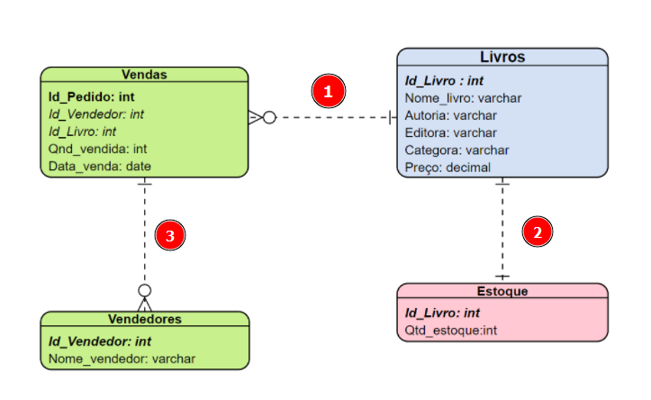

## **Faça como eu fiz: criando as outras tabelas**

Para criar uma tabela usamos o comando `CREATE TABLE` e logo em seguida o nome da tabela que será criada. Após o nome da tabela abrimos e fechamos parênteses, e todos os campos e seus tipos serão definidos dentro desses parênteses. Para finalizar também será declarado o campo que é chave primária usando o comando `PRIMARY KEY`.

O modelo relacional do Clube do Livro define quatro diferentes tipos de tabelas: Livros, Estoque, Vendas e Vendedores. Construa comigo cada uma delas!

1. Tabela `Livros`:

```sql
CREATE TABLE LIVROS (
ID_LIVRO INT NOT NULL,
NOME_LIVRO VARCHAR(100) NOT NULL,
AUTORIA VARCHAR(100) NOT NULL,
EDITORA VARCHAR(100) NOT NULL,
CATEGORIA VARCHAR(100) NOT NULL,
PREÇO DECIMAL(5,2) NOT NULL,
 PRIMARY KEY (ID_LIVRO)
);
```

2. Tabela Estoque:

```sql
CREATE TABLE ESTOQUE (
ID_LIVRO INT NOT NULL,
QTD_ESTOQUE INT NOT NULL,
 PRIMARY KEY (ID_LIVRO)
);
```

3. Tabela Vendas:

```sql
CREATE TABLE VENDAS (
ID_PEDIDO INT NOT NULL,
ID_VENDEDOR INT NOT NULL,
ID_LIVRO INT NOT NULL,
QTD_VENDIDA INT NOT NULL,
DATA_VENDA DATE NOT NULL,
 PRIMARY KEY (ID_VENDEDOR,ID_PEDIDO)
);
```

4. Tabela Vendedores:

```sql
CREATE TABLE VENDEDORES (
ID_VENDEDOR INT NOT NULL,
NOME_VENDEDOR VARCHAR(255) NOT NULL,
 PRIMARY KEY (ID_VENDEDOR)
);
```

## **Faça como eu fiz: definindo as relações entre tabelas**

Para estabelecer a relação entre duas tabelas já criadas é preciso alterar uma tabela definindo o campo que será a chave estrangeira e finalizando fazendo referência ao campo de outra tabela. No modelo relacional abaixo, percebemos três diferentes ligações. Vamos criar cada uma delas?



1. Relação entre as tabelas `Vendas` e `Livros`

O comando abaixo irá alterar a tabela `Vendas` (tabela filha), adicionando a restrição de chave estrangeira apelidada de `CE_VENDAS_LIVROS` que referencia a tabela `Livros` (tabela pai), vinculando as colunas `ID_LIVRO` de ambas as tabelas.

```sql
ALTER TABLE VENDAS ADD CONSTRAINT CE_VENDAS_LIVROS
FOREIGN KEY (ID_LIVRO)
REFERENCES LIVROS (ID_LIVRO)
ON DELETE NO ACTION
ON UPDATE NO ACTION;
```

2. Relação entre as tabelas `Livros` e `Estoque`

```sql
ALTER TABLE ESTOQUE ADD CONSTRAINT CE_ESTOQUE_LIVROS
FOREIGN KEY (ID_LIVRO)
REFERENCES LIVROS (ID_LIVRO)
ON DELETE NO ACTION
ON UPDATE NO ACTION;
```

Lembrando que essa relação já foi a adicionada no vídeo anterior, integridades referenciais, caso já tenha feito pode pular para o próximo passo para evitar duplicidade.

3. Relação entre as tabelas `Vendedores` e `Vendas`

```sql
ALTER TABLE VENDAS ADD CONSTRAINT CE_VENDAS_VENDEDORES
FOREIGN KEY (ID_VENDEDOR)
REFERENCES VENDEDORES (ID_VENDEDOR)
ON DELETE NO ACTION
ON UPDATE NO ACTION;
```

Após escrever todas as restrições, basta selecionar o código e executá-lo. No MySQL Workbench, é usando o atalho CTRL + ENTER ou apertando no botão de raio no menu superior.

A restrição de **chave estrangeira** garante a integridade referencial. Aqui no “faça como eu fiz”, foram estabelecidas todas as ligações entre tabelas do modelo relacional do Clube do Livro.

Lembre-se que declaramos o padrão `NO ACTION` para os comandos `ON DELETE` e `ON UPDATE`, a qual, de modo simplificado, significa que será gerado um erro ao alterar uma nova observação na tabela filha que não exista na tabela pai. Essa é uma das maneiras de personalizar a referência entre as tabelas.

## **Faça como eu fiz: inserir uma linha na tabela**

Para inserir uma linha na tabela com a linguagem SQL utilizamos o comando `INSERT INTO`. Quando criamos a tabela `LIVROS` definimos os campos `ID_LIVRO` como `INT`, `NOME_LIVRO`, a `AUTORIA`, a `EDITORA` e a `CATEGORIA` como `VARCHAR(100)` e o último campo o `PREÇO` como `DECIMAL(5,2)`.

Seguindo a ordem desses campos podemos inserir o livro Percy Jackson e o Ladrão de Raios e todas essas características usando o comando abaixo:

```sql
INSERT INTO LIVROS VALUES (
 1,
'Percy Jackson e o Ladrão de Raios',
'Rick Riordan',
'Intrínseca',
'Aventura',
34.45
);
```

Insira 1 para código do livro, nome do livro 'Percy Jackson e o Ladrão de Raios', o autor 'Rick Riordan’, a editora 'Intrínseca', o gênero 'Aventura' e por fim o preço 34 reais e 45 centavos. Perceba que todos os campos que são textos (cadeias de caracteres) são escritos entre aspas.

## **Faça como eu fiz: inserir informações nas tabelas**

Ao invés de inserirmos linha por linha executando individualmente, podemos otimizar este processo inserindo múltiplas linhas em uma única execução.

Acompanhe o preenchimento de várias linhas nas diferentes tabelas do Clube do Livro.

1) Informações da tabela `LIVROS`

```sql
INSERT INTO LIVROS VALUES
    (2,'A Volta ao Mundo em 80 Dias','Júlio Verne','Principis','Aventura',21.99),
    (3,'O Cortiço','Aluísio de Azevedo','Panda Books','Romance',47.8),
    (4,'Dom Casmurro','Machado de Assis','Via Leitura','Romance',19.90),
    (5,'Memórias Póstumas de Brás Cubas','Machado de Assis','Antofágica','Romance',45),
    (6,'Quincas Borba','Machado de Assis','L&PM Editores', 'Romance',48.5),
    (7,'Ícaro','Gabriel Pedrosa','Ateliê','Poesia',36),
    (8,'Os Lusíadas','Luís Vaz de Camões','Montecristo','Poesia',18.79),
    (9,'Outros Jeitos de Usar a Boca','Rupi Kaur','Planeta','Poesia',34.8);
```

2) Informações da tabela `VENDEDORES`

```sql
INSERT INTO VENDEDORES 
VALUES
(1,'Paula Rabelo'),
(2,'Juliana Macedo'),
(3,'Roberto Barros'),
(4,'Barbara Jales');
```

3) Informações da tabela `VENDAS`

```sql
INSERT INTO VENDAS 
VALUES 
(1, 3, 7, 1, '2020-11-02'),
(2, 4, 8, 2, '2020-11-02'),
(3, 4, 4, 3, '2020-11-02'),
(4, 1, 7, 1, '2020-11-03'),
(5, 1, 6, 3, '2020-11-03'),
(6, 1, 9, 2, '2020-11-04'),
(7, 4, 1, 3, '2020-11-04'),
(8, 1, 5, 2, '2020-11-05'),
(9, 1, 2, 1, '2020-11-05'),
(10, 3, 8, 2, '2020-11-11'),
(11, 1, 1, 4, '2020-11-11'),
(12, 2, 10, 10, '2020-11-11'),
(13, 1, 12, 5, '2020-11-18'),
(14, 2, 4, 1, '2020-11-25'),
(15, 3, 13, 2,'2021-01-05'),
(16, 4, 13, 1, '2021-01-05'),
(17, 4, 4, 3, '2021-01-06'),
(18, 2, 12, 2, '2021-01-06');
```

4) Informações da tabela `ESTOQUE`

```sql
INSERT INTO ESTOQUE 
VALUES
(1,  7),
(2,  10),
(3,  2),
(8,  4),
(10, 5),
(11, 3),
(12, 3);
```

## **Faça como eu fiz: excluindo uma linha**

Com a demanda do comercial teremos que excluir o Livro 'Os Lusíadas' de código número 8 utilizando o comando DELETE.

```sql
#Deletando um livro que não será mais vendido
DELETE FROM LIVROS 
WHERE ID_LIVRO = 8;
```

A outra alteração demandada foi por conta da temporada de promoções do Clube do Livro que garantiu 10% de descontos em todos os livros.

```sql
#Reajuste do preço do livro
UPDATE LIVROS SET PREÇO = 0.9 * PREÇO;
```
