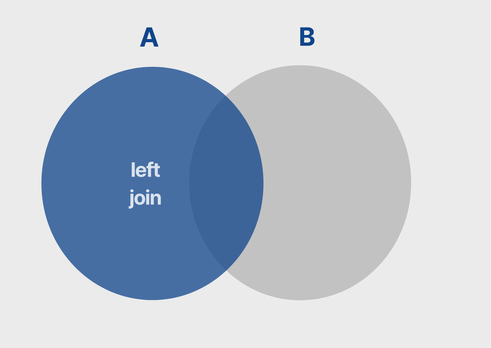
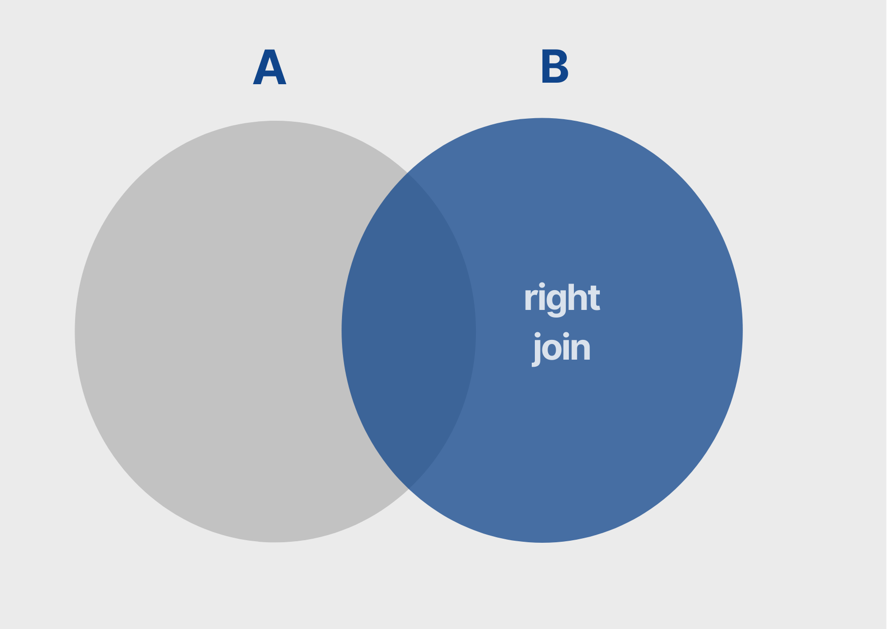
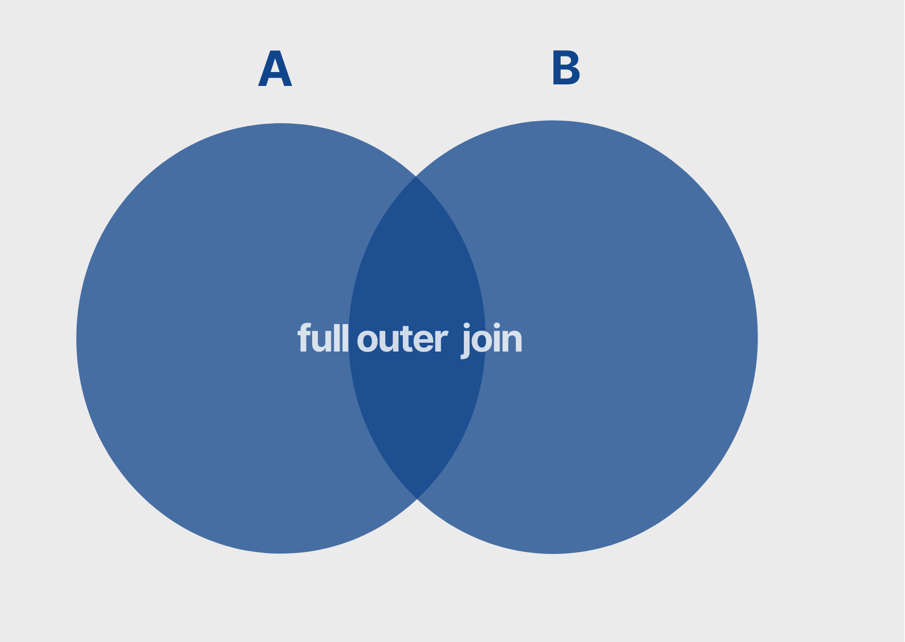
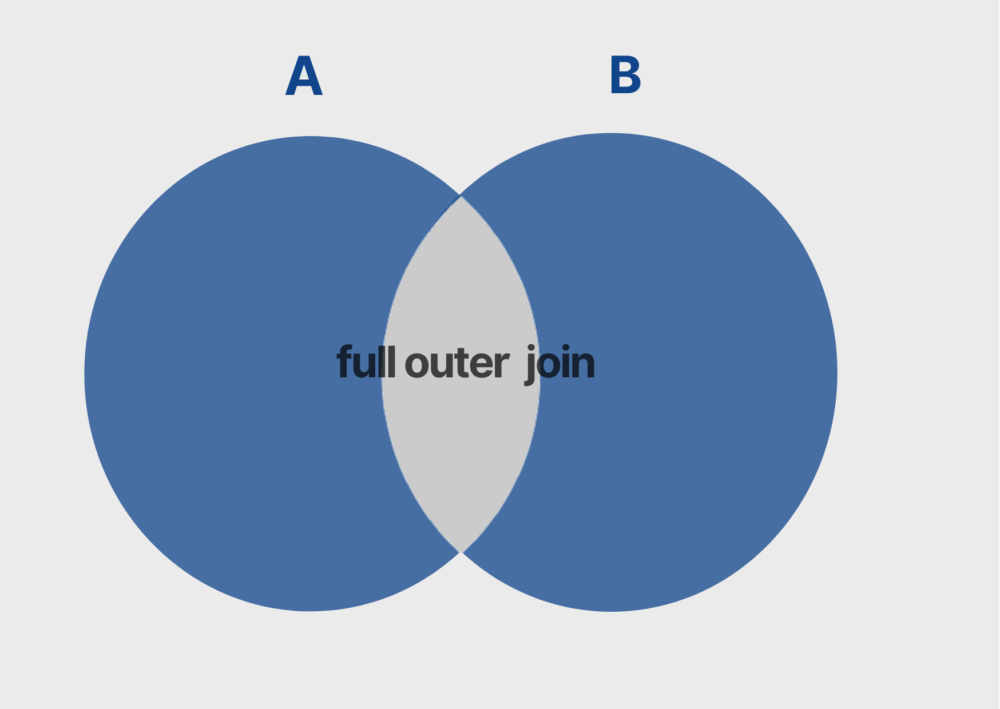

## **Para saber mais: principais tipos de dados em SQL**

Ao criar a tabela Livros percebemos que é preciso definir não só o nome dos campos, mas também o seu tipo. Abaixo encontra-se uma tabela com os principais comandos para definição de tipos utilizados na linguagem SQL.

Lembrando que alguns SGBD’s possuem comandos diferenciados para a mesma finalidade, um exemplo disso é a indicação de uma cadeia de caracteres, pois em alguns sistemas usa-se `char` e em outros é usado o comando `character` ambos para tipificar como texto.

<table>
<thead>
<tr>
<th><strong>Categoria</strong></th>
<th><strong>Descrição</strong></th>
<th><strong>Exemplo</strong></th>
<th><strong>Comando</strong></th>
</tr>
</thead>
<tbody>
<tr>
<td>Numéricos exatos</td>
<td>Inteiros de vários tamanhos que podem ser formatados</td>
<td>9.78 pode ser definida como <code>decimal(3,2)</code> 9 é número inteiro é do tipo <code>int</code>.</td>
<td>int, smallint, decimal(i,j), numeric(i,j), dec(i,j)</td>
</tr>
<tr>
<td>Numéricos aproximados</td>
<td>Números de ponto flutuante com precisão</td>
<td>7.90 é do tipo float</td>
<td>float ou real, double precision</td>
</tr>
<tr>
<td>Cadeias de caracteres</td>
<td>Textos de tamanhos fixos</td>
<td>“modelagem” é char(9)</td>
<td>char(n) ou character(n)</td>
</tr>
<tr>
<td></td>
<td>Texto de tamanho variável</td>
<td></td>
<td>varchar(n) ou char varying(n) ou character varying(n)</td>
</tr>
<tr>
<td>Valores lógicos</td>
<td>Termos que representa verdadeiro ou falso</td>
<td></td>
<td>true, false ou unknown</td>
</tr>
<tr>
<td>Datas</td>
<td>Datas, dias, mês, anos.</td>
<td>Calendário lunar, calendário comercial</td>
<td>Date DD-MM-YYYY ou YYYY-MM-DD-</td>
</tr>
<tr>
<td></td>
<td>Tempo</td>
<td>10:59:13 é tipo HH:MM:SS</td>
<td>HH:MM:SS, timestamp</td>
</tr>
</tbody>
</table>

Mesmo com o padrão ANSI, cada SGBD tem seu manual com mais detalhes sobre tipos específicos.

## **Para saber mais: informações em outra ordem**

Também podemos fazer a inserção de informações em ordem diferente dos campos que foram declarados na tabela.

Vamos inserir três biografias na tabela `LIVROS`, entretanto inserindo a categoria depois a autoria, o nome do livro, a editora e por último o código do livro e seu preço. Usando essa ordem precisamos declarar o nome dos campos antes do comando `VALUES`.

```sql
#Inserindo valores fora de ordem
INSERT INTO LIVROS 
(CATEGORIA, AUTORIA, NOME_LIVRO, EDITORA, ID_LIVRO, PREÇO)
VALUES
('Biografia','Malala Yousafzai', 'Eu sou Malala', 'Companhia das Letras', 11, 22.32),
('Biografia','Michelle Obama', 'Minha história', 'Objetiva', 12, 57.90),
('Biografia','Anne Frank', 'Diário de Anne Frank', 'Pe Da Letra', 13, 34.90);
```
Lembrando se você quiser excluir alguma tabela você pode usar o comando `DROP`, assim como mostra o código abaixo. Ah! Só não esqueça de desativar (usando o comando `SET FOREIGN_KEY_CHECKS = 0;` ) e ativar (usando o comando `SET FOREIGN_KEY_CHECKS = 1;` ) as restrições de chave estrangeira para realizar a exclusão.

```sql
#######Código Extra########
# Excluindo uma tabela
DROP TABLE VENDEDORES;
```
## **Para saber mais: identificando parte dos valores**

Imagine uma lista de cidades que terminam com “lândia”. Para localizar essas cidades, podemos filtrar os nomes das que sabemos, como por exemplo Uberlândia em Minas Gerais e Analândia em São Paulo.

```sql
SELECT CIDADE, ESTADO
FROM MAPA
WHERE CIDADE = "Uberlândia" OR CIDADE = "Analândia";
```
<table>
   <thead>
      <tr>
         <th>CIDADE</th>
         <th>ESTADO</th>
      </tr>
   </thead>
   <tbody>
      <tr>
         <td>Uberlândia</td>
         <td>MG</td>
      </tr>
      <tr>
         <td>Analândia</td>
         <td>SP</td>
      </tr>
   </tbody>
</table>

Mas podemos otimizar nosso código para parecer todas as cidades com essa condição, utilizando o comando `LIKE` que irá extrair valores da tabela que possuem uma parte específica.

Para definir que a parte que queremos é o final das palavras usaremos a notação `%lândia`, como se fosse “alguma coisa” lândia. Veja a construção do comando e o resultado.

```sql
SELECT CIDADE, ESTADO
FROM MAPA
WHERE CIDADE LIKE '%LÂNDIA';
```
<table>
   <thead>
      <tr>
         <th>CIDADE</th>
         <th>ESTADO</th>
      </tr>
   </thead>
   <tbody>
      <tr>
         <td>Analândia</td>
         <td>SP</td>
      </tr>
      <tr>
         <td>Cafelândia</td>
         <td>PR</td>
      </tr>
      <tr>
         <td>Tailândia</td>
         <td>PA</td>
      </tr>
      <tr>
         <td>Uberlândia</td>
         <td>MG</td>
      </tr>
   </tbody>
</table>

Diferente da consulta anterior, apareceram outras cidades que terminam com lândia além daquelas citadas no filtro.

Lembre-se que o `%` é um operador que substitui qualquer valor na procura. Então, caso queira cidades que começam com A, basta usar `A%`. Outro exemplo seria tentar localizar as cidades que contém a sílaba ‘ma’, podemos usar o `%MA%` para aparecer todas as cidades que possuem ‘ma’ posicionada em qualquer lugar.

## **Para saber mais: diminuindo a consulta**

Na programação há diversas maneiras de chegar no mesmo lugar, mas é sempre bom pegar um atalho, não é mesmo?

Para Júlia identificar o nome dos livros que foram vendidos na tabela `VENDAS` podemos construir o código abaixo:

```sql
SELECT LIVROS.NOME_LIVRO,
       VENDAS.QTD_VENDIDA
FROM LIVROS,  VENDAS
WHERE VENDAS.ID_LIVRO = LIVROS.ID_LIVRO;
```
Entretanto, uma outra maneira de otimizar essa consulta é apelidando o nome das tabelas. Usando um apelido com o comando `AS` e referenciando esse apelido nos campos selecionados na consulta.

Então, a consulta anterior pode ser reescrita para:

```sql
SELECT A.NOME_LIVRO,
       B.QTD_VENDIDA
FROM LIVROS AS  A,  VENDAS AS  B
WHERE B.ID_LIVRO = A.ID_LIVRO;
```
Podemos reduzir mais ainda o comando omitindo o `AS`:

```sql
SELECT A.NOME_LIVRO,
       B.QTD_VENDIDA
FROM LIVROS  A,  VENDAS   B
WHERE B.ID_LIVRO = A.ID_LIVRO;
```

Todos os comandos chegam no mesmo resultado, porém podemos usar alguns artifícios que o deixam mais limpos e esclarecedores.

## **Para saber mais: funções de agregação - Métricas**

Além de consultar os valores puramente como foram inseridos na tabela, é comum construirmos informações com métricas que resumem uma tabela. Isso pode ser feito com as funções de agregações, vamos entender cada um dos comandos:

- `MAX`: a partir de um conjunto de valores é retornado o maior entre eles;
- `MIN`: analisa um grupo de valores e retorna o menor entre eles;
- `SUM`: calcula o somatório dos valores de um campo específico;
- `AVG`: realiza a média aritmética dos valores de uma determinada coluna; e
- `COUNT`: contabiliza a quantidade de linhas selecionadas.

Para saber a maior venda feita no Clube do Livro, podemos construir o comando:

```sql
SELECT MAX(QTD_VENDIDA) FROM VENDAS;
```

Usando o `GROUP BY` agrupamos os registros que serão agregados em grupos de valores, permitindo que a função de agregação seja realizada para cada um desses grupos.

Para saber, por exemplo, a maior venda por código de pessoa vendedora podemos consultar da seguinte maneira:

```sql
SELECT MAX(QTD_VENDIDA) FROM VENDAS
GROUP BY(ID_VENDEDOR);
```

Gostaria de saber mais sobre esse assunto? Então, confira outros exemplos de função de agregação no [artigo da Dani Oliveira](https://www.alura.com.br/artigos/trabalhando-funcoes-de-agregacao).

## **Para saber mais: tipos de junção**

Quando temos informações em diferentes tabelas e queremos reunir uma única consulta é comum fazer **junção** entre tabelas. Para explicar a diferença entre os famosos **Joins**, é bem comum representarmos por Diagrama de Venn, onde cada círculo (conjunto) representa uma tabela do nosso modelo relacional. Confira as diferença entre as principais junções:

- **`Inner Join`**

O `INNER JOIN` é a **junção interna**, queinterseção entre duas tabelas, ou seja, na consulta aparecerá todas as informações de um determinado campo da tabela A que também foi encontrado na tabela B.


**Para trazer a interseção das informações entre tabelas, podemos usar o comando:**

```sql
SELECT <CAMPOS>
FROM TABELA_A
INNER JOIN TABELA_B
ON TABELA_A.CAMPO = TABELA_B.CAMPO
```

- **`Left Join`**

O `LEFT JOIN` baseia-se nas informações da tabela declarada à esquerda do comando ao se juntar com outra tabela.



```sql
SELECT <CAMPOS>
FROM TABELA_A
LEFT JOIN TABELA_B
ON TABELA_A.CAMPO = TABELA_B.CAMPO
```

- **`Right Join`**

O `RIGHT JOIN` baseia-se nas informações da tabela declarada à direita do comando ao se juntar com outra tabela.



```sql
SELECT <CAMPOS>
FROM TABELA_A
RIGHT JOIN TABELA_B
ON TABELA_A.CAMPO = TABELA_B.CAMPO
```

- **`Full Outer Join`** 

Esse comando apresenta a união entre duas tabelas.

1. Incluindo a interseção

O `FULL OUTER JOIN` é a união completa entre duas tabelas, incluindo todos os registros de ambas as tabelas, mesmo que não tenham correspondência na outra tabela. Quando não há correspondência, o resultado será NULL para as colunas da tabela que não tem o registro correspondente.



```sql
SELECT <CAMPOS>
FROM TABELA_A
FULL OUTER JOIN TABELA_B
ON TABELA_A.CAMPO = TABELA_B.CAMPO
```

Ou,

```sql
SELECT <CAMPOS>
FROM TABELA_A
LEFT JOIN TABELA_B
ON TABELA_A.CAMPO = TABELA_B.CAMPO

UNION 

SELECT <CAMPOS>
FROM TABELA_A
RIGHT JOIN TABELA_B
ON TABELA_A.CAMPO = TABELA_B.CAMPO
```

2. Excluindo a interseção



```sql
SELECT <CAMPOS>
FROM TABELA_A
INNER JOIN TABELA_B
ON TABELA_A.CAMPO = TABELA_B.CAMPO
WHERE TABELA_A.CAMPO IS NULL OR TABELA_B.CAMPO IS NULL
```